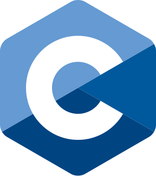
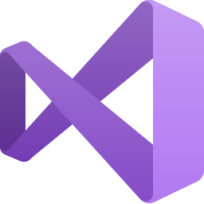

# Hi there, I'm William! 👋

## 🚀 About Me

I'm a software development student with a growing passion for problem-solving and creating efficient solutions. My experience so far leans toward backend development, especially with Java and frameworks like Spring Boot, but I’ve also worked with front-end technologies like Svelte and TypeScript, giving me a solid foundation across the stack.

What excites me most about software development is the continuous learning process. Whether it’s debugging, learning new frameworks and libraries, or refining my coding skills, I’m always eager to expand my knowledge and tackle new challenges.

I’m still early in my journey, but I value collaboration and clear communication as key components of the process. Whether working on my own or in a team, I approach projects with curiosity and a willingness to grow.

### 🎓 Current Status
- **Student:** Bachelor of Computer Science (Honours) at Conestoga College

## 🤝 Let's Connect on [LinkedIn](https://www.linkedin.com/in/william-paetz/)!

## 🌟 Featured Projects

Here are some projects that I'm particularly proud of:
- **[Clan Tracker](https://github.com/Th3-Hero/clan-tracker):** A backend system for collecting and analyzing real-time driving data, including speed, weather, and driving events like harsh braking.
- **[Event Bot](https://github.com/Th3-Hero/EventBot):** An event management system that helps track academic milestones and sends automated reminders via Discord.
- **[DriveGuard](https://github.com/Th3-Hero/DriveGuard-Server):** A tool to track and manage World of Tanks clan activity, focusing on key metrics like battle statistics and member participation.
- **[Task Tiger](https://github.com/Th3-Hero/TaskTiger):** A command line task management app written in C.

_Feel free to check out these repos on my GitHub!_

## 🛠️ Tech Stack

#### Languages:

#### Major Frameworks & Libraries:

#### Databases:

#### Operating Systems:

#### Tools:

## 🎮 Hobbies

When I'm not coding, I enjoy:
- Gaming 🎮
- Paintball 🎨💥
- Reading Articles 📰
- Listening to music 🎧
